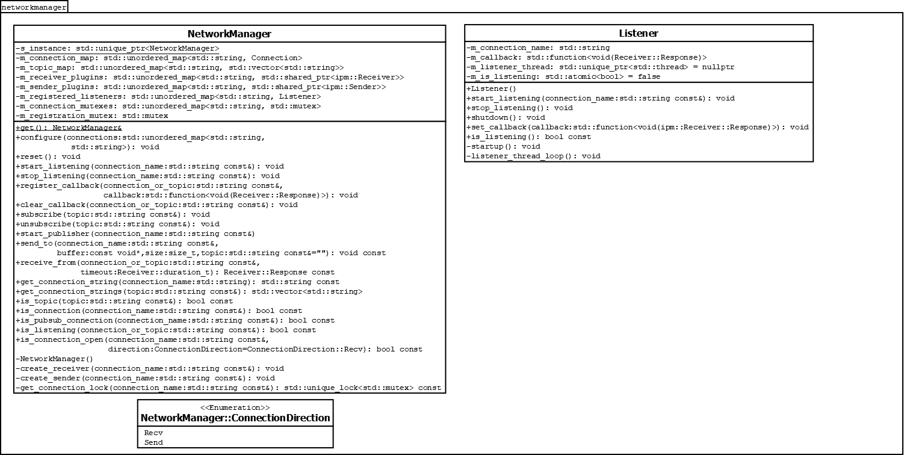

# NetworkManager

This repository contains the _NetworkManager_ class, which is used to provide a convenient interface for performing network sends and receives directly from DAQModules.

## Using Network Manager

NetworkManager is available within all `daq_application` instances, by calling the static `NetworkManager::get()` method.

### Receiving Data from Network Connections

NetworkManager supports a callback-based architecture for receiving messages from the network. Whenever a message arrives, the configured callback is called on a thread. It is the callback's responsibility to deserialize the message and perform any validity checks.

The sequence of events for a receiver should be:

1. Call `NetworkManager::get().start_listening(connection_name)` during `conf`
1. Call `NetworkManager::get().register_callback(connection_name, callback_method)` during `start`. Once `register_callback` has been called, any subsequent messages on that connection will invoke the callback code.
1. Call `NetworkManager::get().clear_callback(connection_name)` during `stop`
1. Call `NetworkManager::get().stop_listening(connection_name)` during `scrap`

NetworkManager is reponsible for opening sockets and handling the polling for data on the socket.

### Sending Data to the network

Sending data using NetworkManager is as simple as calling `NetworkManager::get().send_to` with a serialized message. The connection name is required, and if it is a publish operation, the topic must also be specified.

### Considerations for Publish/Subscribe Connections

Because pub/sub sockets have reversed `bind` semantics from standard "push/pull" sockets (i.e. for pub/sub the sender calls `bind` whereas for push/pull the receiver calls `bind`), the recommended order of operations on the receive side is altered so that `start_listening` and `register_callback` are both called at `start`. The publisher, meanwhile, should call `start_publisher` at `conf` to open the socket to listen for subscribers.

Additionally, subscribers can choose whether to call `start_listening` to receive messages on a given connection or to call `subscribe` with a topic to receive messages from any connection that has declared that topic in its configuration.

### Configuring NetworkManager

Currently, NetworkManager is statically configured during the `init` step. Each nwmgr::Connection object contains the name of the connection, the address of the `bind` endpoint, and a list of topics supported on that connection.

## API Description

